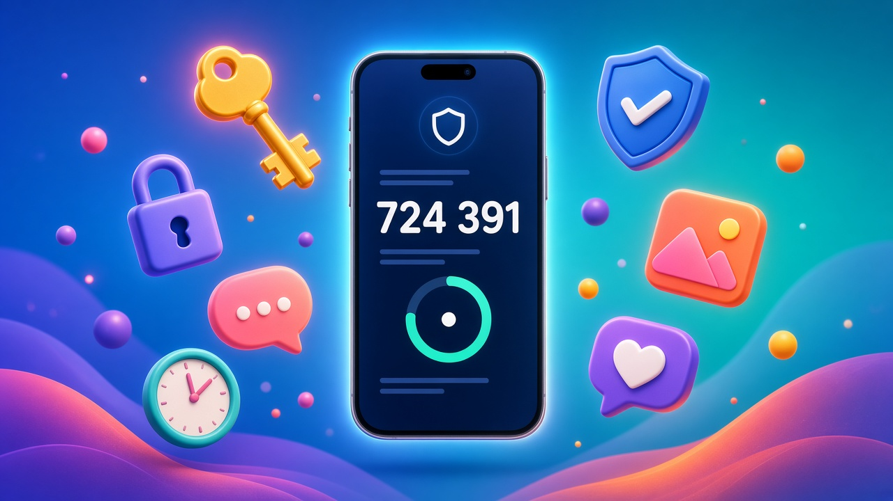
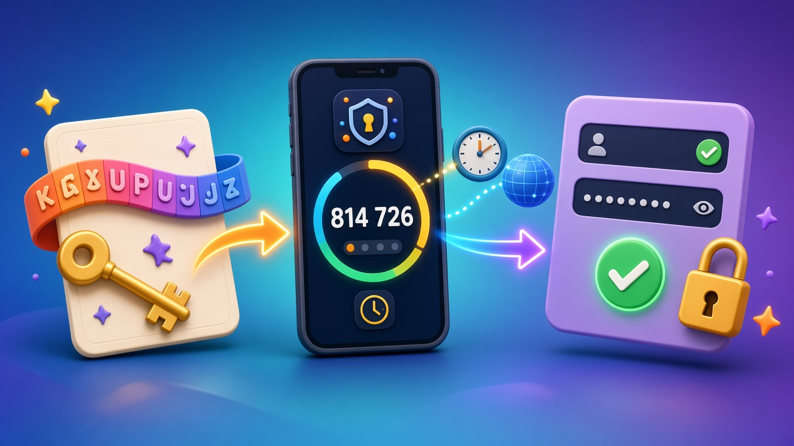

# [2FA密钥怎么用？一篇看懂2FA验证码生成与IG/FB/X/Threads首登教程（2026）](https://hxpuzi.com/instagram/?utm_source=github)

买到的 Instagram、Facebook、X、Threads 账号，交付串里几乎都有一段 **2FA 密钥**（例如 `用户名 | 密码 | 2FA密钥`）。很多人卡在第一步：**这串字母怎么变成登录要的 6 位验证码？** 本文用一页讲清：密钥和验证码的区别、用验证器生成验证码、30 秒有效期与手机时间同步、备用码，以及四个平台的首登顺序和登录后的安全接管。只讲到手验收与安全接管，不涉及任何绕过平台规则的内容。

> 价格与库存以火星小铺官网实时页面为准（本文核对日：**2026-10-05 HKT**）。

---

## 一句话结论

- **2FA 密钥（secret）**：一串固定字母数字（常见 16 或 32 位，只含 A–Z 和 2–7），相当于验证码的“种子”，**要长期保存**。
- **6 位验证码（TOTP）**：验证器用「密钥 + 当前时间」算出来，**每 30 秒换一次**，只能当场用。
- **生成验证码**：把密钥导入 Google Authenticator / Microsoft Authenticator 等本地验证器 App，最稳妥；网页工具只作临时备选。
- **最常见失败原因**：手机时间不准、密钥多了空格或抄错、把码填到了别的账号。
- **验收顺序**：先用原始交付信息完整登录一次（不改任何东西）→ 留证 → 再改密、换 2FA、存备用码。

---

## 2FA 密钥 vs 6 位验证码：别再混了

| 对比 | 2FA 密钥（secret） | 6 位验证码（TOTP） |
| --- | --- | --- |
| 长什么样 | `ABCD 1234 EFGH ...` 一长串（字母 + 2–7 数字） | `814726` 六位数字 |
| 从哪来 | 随交付串一起给你 | 验证器 App 根据密钥和时间实时算出 |
| 有效期 | 长期有效，直到你在平台里重置 2FA | 约 30 秒，过期作废 |
| 填在哪 | 只填进**验证器**，不要填进登录框 | 填进平台登录时的「验证码 / 安全码」框 |
| 怎么保管 | 离线备份，绝不发给他人、不贴到公开处 | 用完即弃，无需保存 |

**小技巧**：标准 2FA 密钥（Base32）里**不会出现数字 0、1、8、9**。如果你看到“0”，多半是字母 O；看到“1”，多半是字母 I 或 L。

---

## 怎么用 2FA 密钥生成验证码（3 种方式）

### 方式 A：本地验证器 App（推荐）

1. 安装 **Google Authenticator** 或 **Microsoft Authenticator**（应用商店官方版本）。
2. Google Authenticator：点 **+** → **输入设置密钥**；Microsoft Authenticator：**添加账户 → 其他账户 → 手动输入代码**。
3. 账户名填**平台 + 用户名**（如 `IG-username123`），便于区分多个号。
4. 密钥栏粘贴交付的 2FA 密钥，**去掉所有空格**，类型选「基于时间」。
5. 保存后出现 6 位数字和倒计时圈，就是当前验证码。

### 方式 B：网页 2FA 工具（只作临时备选）

类似 2fa.live 的网页工具，粘贴密钥即可显示 6 位码，省去装 App。但**密钥会被提交到第三方网站**，等于多一个人可能看到它。只在首登验收时临时用；验收通过后务必在平台里**重置 2FA**，让旧密钥作废（见下文「安全接管」）。

### 方式 C：密码管理器自带的 2FA

1Password、Bitwarden 等支持保存 TOTP 密钥并显示验证码，适合把“密码 + 2FA”放在同一个加密保险箱里统一管理。

### 先把手机时间调准

验证码依赖时间。手机请开启 **自动设置日期与时间 / 自动时区**；电脑端工具同理。时间差超过几十秒，码就会一直提示无效。

---

## 下单前 30 秒核对

1. 打开商品页，看**账号格式**里是否写明含 2FA 密钥（如 `用户名 | 密码 | 2FA密钥`）。
2. 读清 **包首登 / 登录质保** 条款：一般只覆盖交付后首次登录（多数商品为交付当日或约 24 小时内），登录成功后你做的修改不在质保范围。
3. 建议先买 1 个走通流程，再按需求加量。

官网在售、含 2FA 的入门规格（核对日 2026-10-05，单个标价）：

| 商品 | 价格 | 交付要点 |
| --- | --- | --- |
| [Instagram新账号（含2FA密钥·已加头像）](https://hxpuzi.com/instagram-new-login-2fa-key-profile-pictures/?utm_source=github) | **¥1.80** | 用户名 \| 密码 \| 2FA密钥；登录质保交付时生效 |
| [Threads新账号（2FA密钥已启用·支持全球登录）](https://hxpuzi.com/threads-new-2fa-key-global-login/?utm_source=github) | **¥1.80** | 用户名 \| 密码 \| 2FA密钥；登录质保 + 12 小时换货质保 |
| [美国 Facebook 半年老号（开启2FA·含邮箱密码·包首次登录）](https://hxpuzi.com/facebook-us-6month-aged-usd-2fa-first-login/?utm_source=github) | **¥27.94** | 2FA + 邮箱密码；包首次登录 |
| [推特账号 2020–2025年注册（邮箱可用·启用2FA·含Token）](https://hxpuzi.com/buy-twitter-accounts-token/?utm_source=github) | **¥5.76** | 账号 \| 密码 \| 邮箱 \| 2FA \| token；24 小时内包首次登录 |

分类入口：[Instagram](https://hxpuzi.com/instagram/?utm_source=github) · [Threads账号](https://hxpuzi.com/threads-account/?utm_source=github) · [Facebook](https://hxpuzi.com/facebook/?utm_source=github) · [X/Twitter](https://hxpuzi.com/x-twitter/?utm_source=github)

[立即购买](https://hxpuzi.com/instagram-new-login-2fa-key-profile-pictures/?utm_source=github) · [查看分类](https://hxpuzi.com/instagram/?utm_source=github)

---

## 各平台首登顺序（IG / FB / X / Threads）

通用前提：先把密钥导入验证器、手机时间已同步；一次只登录一个账号；只从官方 App 或手动输入的官方域名登录。

| 平台 | 首登顺序 | 注意 |
| --- | --- | --- |
| **Instagram** | 官方 App 或 instagram.com → 用户名 + 密码 → 提示输入 6 位安全码时，填验证器当前码 → 进入主页 | 出现「这是你吗」等确认，按页面提示完成；详见官网 [Instagram登录教程](https://hxpuzi.com/article/ig-tutorial/?utm_source=github) |
| **Facebook** | facebook.com → UID / 邮箱 + 密码 → 双重验证页如默认要短信，点「尝试其他方式」选**身份验证应用** → 填 6 位码 | 有邮箱的规格，再单独确认邮箱能登录收信；详见 [Facebook交付格式与首登验收](https://hxpuzi.com/article/facebook-uid-2fa-email-cookie-delivery-acceptance-guide/?utm_source=github) |
| **X / Twitter** | 手动输入 x.com → 用户名 + 密码 → 输入身份验证应用的验证码 → 如要求邮箱确认码，去交付邮箱查收 | Token 是敏感凭据，勿贴到第三方网站；详见 [X/Twitter到手验收清单](https://hxpuzi.com/article/x-twitter-email-2fa-token-first-login-acceptance-guide/?utm_source=github) |
| **Threads** | Threads 通常与 Instagram 账号相连：用交付的用户名 + 密码登录，出现双重验证时填同一把密钥生成的码 | 交付里只有一把 2FA 密钥时，IG 与 Threads 共用它；可参考 [Instagram地区号首登清单](https://hxpuzi.com/article/instagram-region-account-first-login-verification-guide/?utm_source=github) |

---

## 首登失败排查表

| 现象 | 常见原因 | 怎么处理 |
| --- | --- | --- |
| 验证码无效 / 错误 | 码刚好过期；时间不同步 | 等倒计时刷新后用**新码**再试一次；开启手机自动时间 |
| 一直无效、电脑和手机码不同 | 设备时间漂移 | 两端都开自动时间并重开验证器；仍不一致就换一台时间准确的设备生成 |
| App 提示密钥无效 | 密钥带空格、换行，或把 O/0、I/1 抄混 | 去掉空格换行，从交付原文**复制粘贴**而不是手抄 |
| 码对了但登不上 | 导入时选错条目，填了另一个号的码 | 条目用「平台-用户名」命名；核对当前条目对应的账号 |
| 提示尝试次数过多 | 短时间连续乱试 | **立即停止**，隔一段时间再试；不要反复输错 |
| 登录要短信 / 邮箱码而非验证器 | 平台默认选了其他验证方式 | 点「尝试其他方式」选身份验证应用；邮箱码去交付邮箱查收 |
| 提示密码错误 | 复制多了空格；网络环境或缓存问题 | 确认无空格与全角符号，清除缓存后再试一次 |

以上处理后仍失败：**停止重试**，保留订单号、交付原文、报错截图（遮住密码与密钥）和发生时间，在包首登窗口内联系火星小铺售后。

---

## 登录成功后：安全接管与备份

先确认原始交付信息能完整登录、留好证据，再按顺序做：

1. **保存交付原文**：账号、密码、2FA 密钥、邮箱（如有）、订单号，存进密码管理器或加密笔记，不要只留在聊天窗口。
2. **修改密码**：改成足够长的独立密码；含邮箱的规格，邮箱密码也一并更新。
3. **重置 2FA**：在平台安全设置里重新设置身份验证应用，扫描**新**二维码 / 新密钥，让卖家和网页工具接触过的旧密钥作废。
4. **保存备用码**：Instagram、Facebook、X 的双重验证设置里都能生成一组备用码（恢复码），抄下或离线保存；手机丢失时靠它登录。
5. **检查会话与授权**：退出不认识的登录会话，撤销不需要的第三方应用授权。
6. **一次只改一项**：每改完一项确认仍能正常登录，再做下一项，方便排查。

**包首登边界**：质保覆盖的是“用原始交付信息首次登录可用”，一般在交付当日或约 24 小时内（以各商品页为准）。登录成功后你自行修改的密码、2FA 和资料不在质保范围；也没有任何商品能承诺长期不封。所以**先验收、后修改**的顺序很重要。

---

## 常见问题

**Q1：2FA 密钥和验证码哪个要保存？**  
保存密钥（以及重置后的新密钥和备用码）；6 位验证码 30 秒就作废，不用存。

**Q2：可以只用网页工具生成验证码吗？**  
可以临时用，但密钥会经过第三方网站。验收后请在平台里重置 2FA，并改用本地验证器长期管理。

**Q3：换手机了验证码怎么办？**  
提前用验证器的导出 / 云备份功能迁移，或用离线保存的密钥在新手机重新导入；都没有时用备用码登录后重新绑定。

**Q4：Threads 和 Instagram 用的是同一个 2FA 吗？**  
Threads 通常与 Instagram 账号相连，交付只有一把密钥时按同一把生成验证码；以商品页交付说明为准。

**Q5：包首登包括什么？**  
一般覆盖交付后首次登录可用性（详见各商品页）；不包括你改密换绑之后的问题，也不包括违规使用导致的限制。

---

## 总结

1. 密钥是种子，长期保存；验证码 30 秒一换，当场用掉。
2. 用本地验证器导入密钥，手机时间开自动同步；网页工具只作临时备选。
3. 按平台顺序首登：账号 + 密码 → 验证器 6 位码 → 必要时邮箱确认。
4. 先验收留证，再改密、重置 2FA、保存备用码；失败在包首登窗口内找售后。
5. 规格与价格以官网商品页为准：[Instagram](https://hxpuzi.com/instagram/?utm_source=github) · [Threads账号](https://hxpuzi.com/threads-account/?utm_source=github) · [Facebook](https://hxpuzi.com/facebook/?utm_source=github) · [X/Twitter](https://hxpuzi.com/x-twitter/?utm_source=github)，更多教程见 [使用教程列表](https://hxpuzi.com/articles/?utm_source=github)。

[立即购买](https://hxpuzi.com/instagram-new-login-2fa-key-profile-pictures/?utm_source=github) · [查看分类](https://hxpuzi.com/instagram/?utm_source=github)

---

*本文为火星小铺站外教程索引的一部分；渠道参数 `utm_source=github`。*
