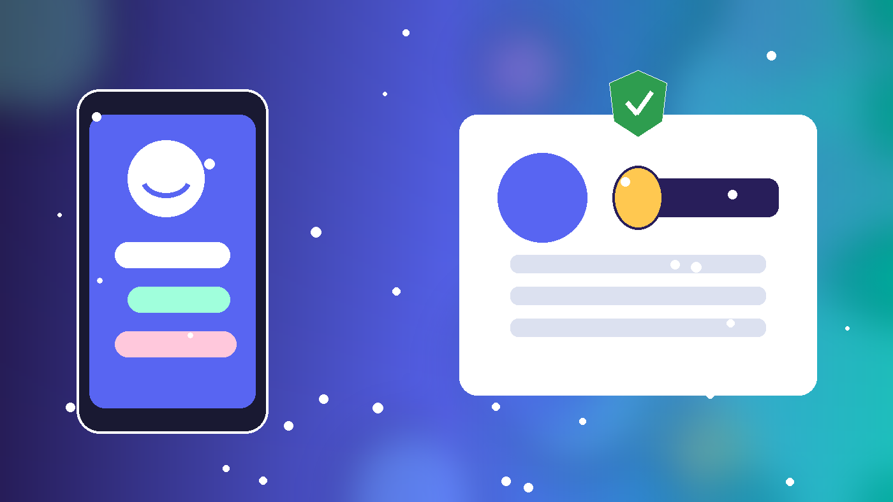
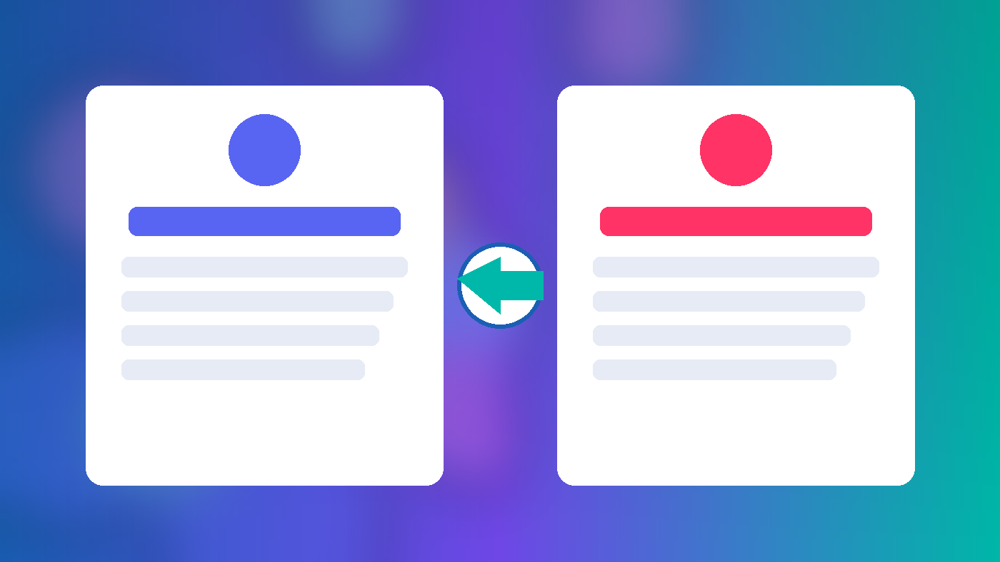
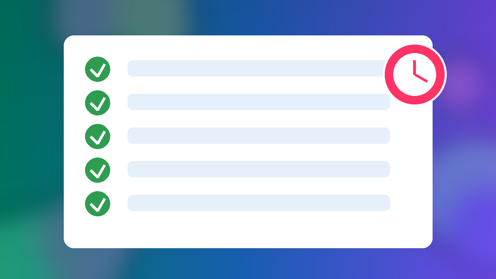

# Discord账号Token登录怎么用？满月号与半年老号到手验收教程（2026）

Discord账号购买后，交付信息里常见 **邮箱 + 密码 + 2FA 密钥 + Token**。本文用官网在售的两款 Discord 号（满月号、半年以上老号）说明：**Token 登录和邮箱密码登录有什么区别**、到手后 **5 分钟怎么验收**、以及 **包首登** 边界内如何留证与加固。只讲验收与安全接管，不涉及任何绕过平台规则的操作。

> 价格与库存以官网实时页面为准（本文核对日：**2026-09-30 HKT**）。

---

## 一句话结论

- **Token**：客户端会话凭证，适合快速验证「这个号此刻能否进客户端」；它**不能**替代你长期保管邮箱与 2FA。
- **邮箱 + 密码 + 2FA**：真正的账号所有权凭证；验收通过后应尽快改密、确认邮箱可控、备份 2FA。
- 官网两款 InStock（核对日 2026-09-30）：
  - [Discord 满月号（邮箱 + 2FA + Token + 头像）](https://hxpuzi.com/buy-discord-account-one-month-old-email-two-fa-token-avatar/?utm_source=github) — **¥7.20**
  - [Discord 半年以上老号（邮箱 + Token + 头像，Token 登录）](https://hxpuzi.com/buy-discord-account-six-months-old-email-token-avatar-login/?utm_source=github) — **¥8.64**
- 分类入口：[Discord账号](https://hxpuzi.com/discord-account/?utm_source=github)

---

## Token 登录 vs 邮箱 / 密码登录

| 方式 | 你需要什么 | 适合做什么 | 注意 |
| --- | --- | --- | --- |
| Token 登录 | 交付的 Token 字符串 | 快速确认号能进客户端、看头像/用户名 | Token 泄露等于会话被接管；验收后应视为敏感信息 |
| 邮箱 + 密码 | 邮箱、密码，必要时 2FA 动态码 | 正式接管、改密、开/换 2FA | 以「你能独立完成一次完整登录」为验收核心 |
| 邮箱收件 | 邮箱账号与邮箱密码（若交付） | 核对绑定邮箱可控 | 无法进邮箱时，先按售后规则留证，勿反复乱试 |

**边界**：Token 证明「当前会话可用」；**不等于**你已经完成改密与邮箱接管。满月号规格写明启用 2FA；半年老号侧重 Token 登录与耐用，到手后仍应按下方清单核对邮箱与安全项。

---

## 下单前 30 秒选型

1. 只要低成本试水、要 2FA 齐全 → 优先看 [满月号](https://hxpuzi.com/buy-discord-account-one-month-old-email-two-fa-token-avatar/?utm_source=github)。
2. 更看重账龄与 Token 登录场景 → 看 [半年以上老号](https://hxpuzi.com/buy-discord-account-six-months-old-email-token-avatar-login/?utm_source=github)。
3. 先读商品页「包含字段 / 包首登」再下单；建议先买 1 个走通流程。
4. 需要对照其他平台 Token 验收写法，可参考官网教程：[X/Twitter 邮箱、2FA、Token 首登验收](https://hxpuzi.com/article/x-twitter-email-2fa-token-first-login-acceptance-guide/?utm_source=github)。

[立即购买满月号](https://hxpuzi.com/buy-discord-account-one-month-old-email-two-fa-token-avatar/?utm_source=github) · [立即购买半年老号](https://hxpuzi.com/buy-discord-account-six-months-old-email-token-avatar-login/?utm_source=github) · [查看分类](https://hxpuzi.com/discord-account/?utm_source=github)

---

## 交付后 5 分钟验收清单

按顺序做，全部打勾再改资料：

1. **完整保存交付串**  
   账号、密码、邮箱、邮箱密码（如有）、2FA 密钥、Token、订单号。截图或本地加密备份一份，勿只留在聊天窗口。
2. **核对规格字段**  
   - 满月号：应能对上「邮箱 + 启用 2FA + Token + 已上传头像」。  
   - 半年老号：应能对上「邮箱 + Token + 已上传头像 + Token 登录」等商品页描述。
3. **用 Token 做一次快速进端**（若你采用 Token 方式）  
   确认能进入客户端、看到用户名与头像；**不要**把 Token 发到公开频道或截图上传到不可控处。
4. **用邮箱 + 密码完成一次正式登录**  
   需要 2FA 时，用交付的 2FA 密钥在验证器生成 6 位码（注意手机时间同步）。登录成功才算「你控号」。
5. **点开用户设置做只读检查**  
   看绑定邮箱是否与交付一致、2FA 是否已开、最近登录/设备是否异常。本步只查看，先别大改资料。

任一步失败：停止反复重试，保留订单号、交付原文、报错截图与大致时间，在 **包首登** 窗口内联系火星小铺售后（见商品页说明，通常为交付当日或约 24 小时内）。

---

## 验收通过后：安全加固（当天做完）

1. **修改密码**为足够长的独立密码，只保存在你自己的密码管理器。  
2. **确认邮箱可控**：能登录绑定邮箱；若交付含邮箱密码，验收后考虑按商品与售后指引处理换绑节奏（勿在未验收完成前频繁换绑）。  
3. **备份 2FA 密钥**到离线位置；不要只依赖一张截图。  
4. **Token 视为已暴露风险**：正式接管后，以密码 + 2FA 为准；旧 Token 不要再分享给任何人。  
5. **头像 / 用户名 / 简介** 等资料改动放到验收与改密之后，避免与首登排查搅在一起。

---

## 常见问题

**Q1：Token 登录成功，但邮箱密码登不上？**  
先确认是否需要 2FA、验证器时间是否正确、密码是否多复制了空格。仍失败则留证走包首登，不要连续改密码。

**Q2：满月号和半年老号怎么选？**  
要 2FA 写明启用、成本更低 → 满月号（¥7.20）。更看账龄与 Token 登录标注 → 半年老号（¥8.64）。以商品页实时规格为准。

**Q3：包首登包括什么？**  
一般覆盖交付后首次登录可用性（详见该商品页售后文案）。不包括你改密换绑之后的长期承诺，也不包括违规使用导致的限制。

**Q4：可以跳过邮箱验收只用 Token 吗？**  
不建议。Token 只能证明会话，长期控制权仍取决于邮箱与 2FA。至少完成一次邮箱路径登录并改密。

**Q5：和 X/Twitter 的 Token 验收像吗？**  
字段思路类似（邮箱、2FA、Token），平台操作不同。可对照：[X/Twitter 首登验收教程](https://hxpuzi.com/article/x-twitter-email-2fa-token-first-login-acceptance-guide/?utm_source=github)。

---

## 总结

1. 先分清 Token（会话）与邮箱/2FA（所有权）。  
2. 按 5 分钟清单验收，失败就留证走包首登。  
3. 通过后当天改密、备份 2FA、收敛 Token 暴露面。  
4. 规格与价格以 [Discord 分类](https://hxpuzi.com/discord-account/?utm_source=github) 与商品页为准。

[立即购买满月号](https://hxpuzi.com/buy-discord-account-one-month-old-email-two-fa-token-avatar/?utm_source=github) · [立即购买半年老号](https://hxpuzi.com/buy-discord-account-six-months-old-email-token-avatar-login/?utm_source=github) · [查看分类](https://hxpuzi.com/discord-account/?utm_source=github)

---

*本文为火星小铺站外教程索引的一部分；渠道参数 `utm_source=github`。*
