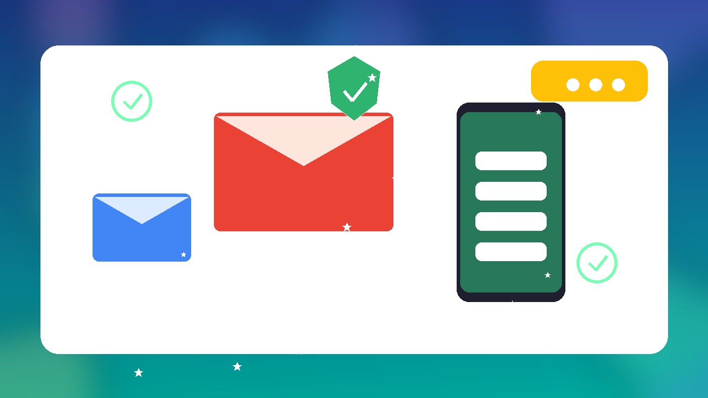
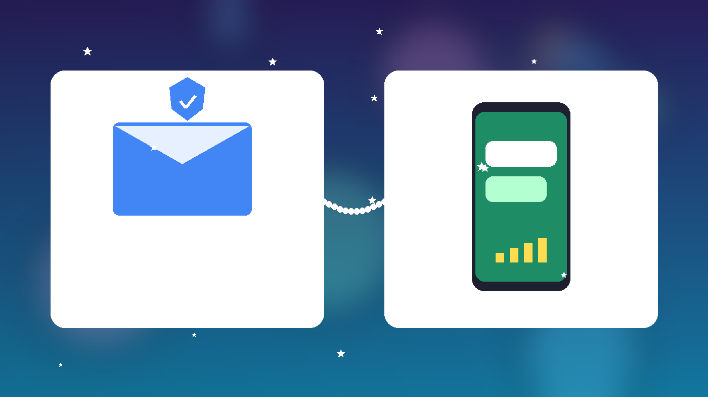
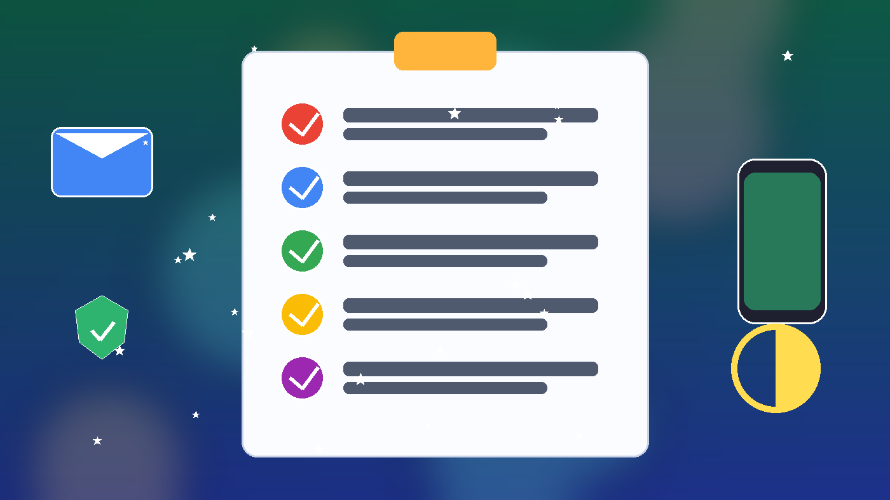

# Gmail账号到手怎么安全登录？辅助邮箱、短信验证与2FA核对教程（2026）

Gmail账号购买后，交付信息里常见 **邮箱地址 + 密码 + 辅助邮箱（recovery email）+ 2FA 密钥**，部分规格还会标注 **已通过短信验证**。本文对照火星小铺官网在售的一款高质量 Gmail（2022 年、启用 2FA、附带辅助邮箱、已短信验证），说明：**辅助邮箱是做什么的**、Google 为什么可能提示「验证是你本人」、以及如何用短信验证字段 + 2FA + 辅助邮箱完成 **5 分钟验收与安全接管**。只讲验收与安全操作，不涉及任何绕过平台规则的内容。

> 价格与库存以官网实时页面为准（本文核对日：**2026-10-02 HKT**）。

---

## 一句话结论

- **辅助邮箱**：账号的备用联系邮箱，用于找回与「验证是你本人」挑战；你必须能登录并收到其邮件，才算真正可控。
- **短信验证**：商品页标注「已通过短信验证」表示该号曾完成手机短信核验；到手后仍要以你能否独立登录、能否用交付字段过验证为准。
- **2FA**：二次验证密钥；登录或敏感操作时用验证器生成 6 位码。时间不同步是最常见失败原因。
- 官网 InStock（核对日 2026-10-02）：
  - [Gmail账号 | 2022年 - 启用 2FA - 附带辅助邮箱 - 已通过短信验证 - 高质量](https://hxpuzi.com/buy-gmail-account-twenty-twenty-two-usa-two-fa-sms-verified-high-quality/?utm_source=github) — **¥46.94**
- 分类入口：[Gmail账号](https://hxpuzi.com/gmail-account/?utm_source=github)

---

## 辅助邮箱、短信验证、2FA 分别管什么

| 字段 | 它证明什么 | 验收时你要做什么 | 注意 |
| --- | --- | --- | --- |
| 辅助邮箱（recovery） | 备用联系通道可控 | 用交付的辅助邮箱账号登录，确认能收验证码邮件 | 辅助邮箱失控时，后续「验证是你本人」会很难过 |
| 短信验证（规格标注） | 该号曾完成手机短信核验 | 对照商品页字段；登录过程若再要短信，按交付说明与售后规则处理 | 不要假设你手里永远有原手机号；以交付字段与包首登为准 |
| 2FA 密钥 | 二次验证所有权 | 导入验证器，生成码完成登录 | 手机时间必须自动同步；勿把密钥发到公开处 |
| 主邮箱 + 密码 | 正式登录入口 | 完整登录一次成功才算「你控号」 | 密码勿多复制空格；失败勿连续乱试 |

**边界**：规格写「附带辅助邮箱 / 已短信验证 / 启用 2FA」≠ 你已经完成改密与接管。验收核心是：**你能独立完成一次完整登录，并能用交付字段通过验证挑战**。

---

## 下单前 30 秒核对

1. 打开商品页，确认含：**2022 年、启用 2FA、附带辅助邮箱、已通过短信验证** 等与你需求一致的字段。  
2. 先读「包含字段 / 包首登」说明，再下单；建议先买 1 个走通流程。  
3. 需要对照「邮箱验证 + 2FA 验收」写法，可参考官网教程：[Reddit 邮箱验证、控号与 2FA 验收指南](https://hxpuzi.com/article/reddit-email-verification-control-2fa-acceptance-guide/?utm_source=github)。  
4. 分类浏览：[Gmail账号](https://hxpuzi.com/gmail-account/?utm_source=github)（也可顺带看 [Google 相关分类](https://hxpuzi.com/google/?utm_source=github)，主入口仍以 Gmail 分类为准）。

[立即购买](https://hxpuzi.com/buy-gmail-account-twenty-twenty-two-usa-two-fa-sms-verified-high-quality/?utm_source=github) · [查看分类](https://hxpuzi.com/gmail-account/?utm_source=github)

---

## 交付后 5 分钟验收清单

按顺序做，全部打勾再改资料：

1. **完整保存交付串**  
   主邮箱、密码、辅助邮箱及其密码（如有）、2FA 密钥、订单号。截图或本地加密备份一份，勿只留在聊天窗口。
2. **核对规格字段**  
   对照商品页：2022 年、启用 2FA、附带辅助邮箱、已通过短信验证、高质量等描述是否与交付一致。
3. **导入 2FA 并完成一次正式登录**  
   把 2FA 密钥导入验证器（注意时间同步）。用主邮箱 + 密码登录；需要 6 位码时用验证器生成。登录成功才算「你控号」。
4. **核对辅助邮箱可控**  
   用交付信息登录辅助邮箱，确认能进入收件箱。若 Google 提示「验证是你本人」并要求辅助邮箱验证码，在此邮箱中查收并填写。
5. **只读检查账号安全页**  
   查看恢复信息、2FA 状态、近期安全活动是否异常。本步只查看，先别大改资料或频繁换绑。

任一步失败：停止反复重试，保留订单号、交付原文、报错截图与大致时间，在 **包首登** 窗口内联系火星小铺售后（见商品页说明，通常为交付当日或约 24 小时内）。

---

## 验收通过后：安全加固（当天做完）

1. **修改主邮箱密码**为足够长的独立密码，只保存在你自己的密码管理器。  
2. **确认辅助邮箱长期可控**：能登录、能收信；备份其密码。未验收完成前不要频繁换绑恢复信息。  
3. **备份 2FA 密钥**到离线位置；不要只依赖一张截图。  
4. **理解「验证是你本人」**：换设备、新地点、敏感操作时 Google 可能再挑战；辅助邮箱与 2FA 是正常过关手段，不是异常。  
5. **资料与恢复信息改动**放到验收与改密之后，避免与首登排查搅在一起。

---

## 常见问题

**Q1：提示「验证是你本人」，该怎么做？**  
优先用交付的辅助邮箱收验证码，或用 2FA 动态码。确认辅助邮箱能登录、验证器时间同步。仍失败则留证走包首登，不要连续改密或乱点「不是我」。

**Q2：短信验证标注了，但登录时又要手机号？**  
按交付说明与商品页售后处理；保留截图与订单号。不要假设你持有原手机号；以包首登窗口内的官方售后指引为准。

**Q3：包首登包括什么？**  
一般覆盖交付后首次登录可用性（详见该商品页售后文案）。不包括你改密换绑之后的长期承诺，也不包括违规使用导致的限制。

**Q4：可以跳过辅助邮箱验收吗？**  
不建议。辅助邮箱是恢复与身份验证的关键通道；至少完成一次辅助邮箱登录并确认能收信。

**Q5：和 Reddit 的邮箱/2FA 验收像吗？**  
字段思路类似（邮箱可控、2FA、首登验收），平台界面不同。可对照：[Reddit 邮箱验证与 2FA 验收](https://hxpuzi.com/article/reddit-email-verification-control-2fa-acceptance-guide/?utm_source=github)。

---

## 总结

1. 分清辅助邮箱（恢复通道）、短信验证（规格核验）、2FA（二次验证）与主密码（正式登录）。  
2. 按 5 分钟清单验收；遇到「验证是你本人」用辅助邮箱/2FA 正常过关，失败则留证走包首登。  
3. 通过后当天改密、备份 2FA、确认辅助邮箱可控。  
4. 规格与价格以 [Gmail 分类](https://hxpuzi.com/gmail-account/?utm_source=github) 与商品页为准。

[立即购买](https://hxpuzi.com/buy-gmail-account-twenty-twenty-two-usa-two-fa-sms-verified-high-quality/?utm_source=github) · [查看分类](https://hxpuzi.com/gmail-account/?utm_source=github)

---

*本文为火星小铺站外教程索引的一部分；渠道参数 `utm_source=github`。*
